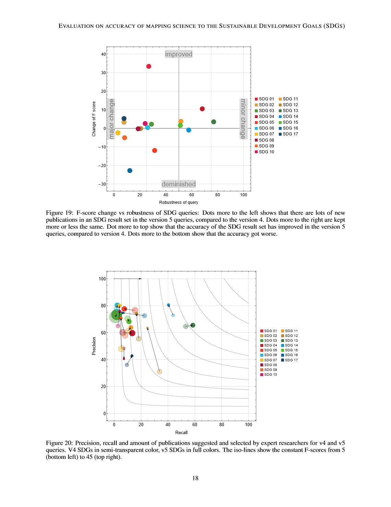

# Evaluation on accuracy of mapping science to the United Nations' Sustainable Development Goals (SDGs) of the Aurora SDG queries

In this study we evaluate the accuracy of our Aurora SDG classification model version 5, to match research papers to the Sustainable Development Goals (SDG's) of the United Nations. The aim of this investigation is to be transparent about the accuracy of the model, because this model might get used in reporting and strategy analysis by University leadership. The measurements are based on a baseline, 'golden set', where researchers of the Aurora universities handpicked publications that relate to an SDG. We measured the Precision and Recall of the Aurora model, and relating it to our previous version of the model, and to the Elsevier SDG model.

